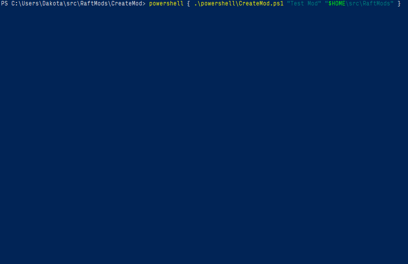

# Create Mod

A utility to generate boilerplate mod projects for the game [Raft](https://raft-game.com/).

## Example Usage

`powershell { .\powershell\CreateMod.ps1 "Test Mod" "$HOME\src\RaftMods" }`

See the [resulting repository here.](https://github.com/dakotahawkins/Raft-Test-Mod)

## TODO

* Handle non-github hosts
* Tag/prepare initial pre-release and push it
* Tell the user what to do after running this utility
* Have the generated project create a local test release and shortcut on successful build
* Rewrite the prepare-release utilities in powershell
* Add `.bat`/`.sh` wrappers for the powershell scripts
